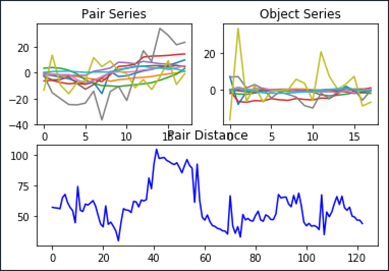

# MultivariateTimeSeriesSimilarity

多维时间序列相似度的对比

## Data
使用2005-2019年的宏观经济指标构成多维时间序列，十个经济指标分别是：
		
		工业增加值:当月同比
		CPI:当月同比
		PPI:全部工业品:当月同比
		M1:同比
		M2:同比
		固定资产投资完成额:累计同比
		PMI
		PMI:原材料库存
		公共财政收入:当月同比
		公共财政支出:当月同比


## 数据清洗

- 数据调频
- 用前后均值填补空缺值


## 模型1
基本思路：
		
		通过pca降维将十维的时间序列降为1维，通过DTW算法做时间序列上的相似度对比


- 将原始数据使用STL的算法进行时间序列的分解，可分解为trend，seasonal和residual，将residual（c + i）抽取进行分析
- 时间序列分解图


- Cycle


- 以18个月最近数据为目标数据进行历史搜索匹配，结果如图




+ **2018.1 - 2019.6 历史最相似 2008.5 - 2009.10**


## 模型2

		在该模型中更加注重指标数据变化的方向，基本思路是先将时间序列分解，从分解中提取trend项，再通过改造的唐奇安通道方法将trend数据构造出数据的方向矩阵，从而进行历史最相似搜索

- 使用STL的算法进行时间序列的分解，将trend项抽取进行数据分析,trend数据如图


- 该模型里的唐奇安通道规则：

		当日数据创前n日新高，设今日变动方向为1，当日数据创前n日新低，设今日变动方向为-1，其他情况设变动方向为0

		根据该方法创立数据的方向矩阵
		
- 根据样本长度分割数据矩阵，并计算矩阵的F-范式做矩阵间的相似度对比
- 原始数据01矩阵图


- 将模型做较直观的结果可视化处理，根据结果将原始数据指标分别画出折线图，可直观做相似度比较

- 以18个月最近数据为目标数据进行历史搜索匹配，结果如图：

```
蓝线代表目标对比数据，黄线代表最相似时段数据，绿线代表最不相似时段数据，
从该算法结果可看出搜索到的最相似矩阵的大部分指标的时间序列形态与目标序列相似，
效果比第一个模型更好
```


- 结果： 

		the object data period is 2018-01-31 00:00:00 to 2019-06-30 00:00:00
		the most similar time period is 2011-05-31 00:00:00 to 2012-10-31 00:00:00
		the most unsimilar time period is 2009-02-28 00:00:00 to 2010-07-31 00:00:00
		
## 改进
- PCA的降维方法改进
- 搜索匹配不同长度中的最佳长度
- DTW算法优化
- 模型3:图片相似度的搜寻
		


